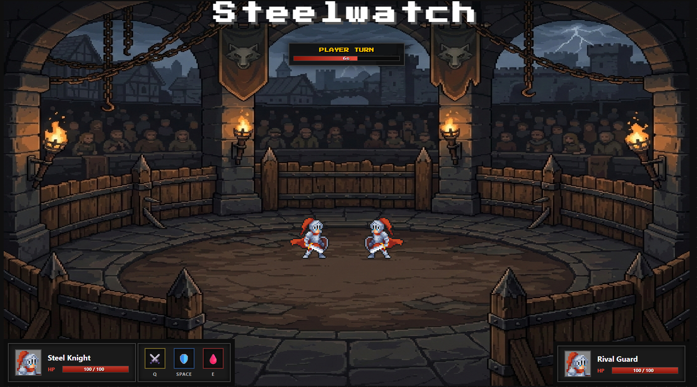

# Steelwatch ⚔️

**Steelwatch** is a strategic, turn-based combat game featuring a dark medieval atmosphere and crisp pixel art. Step into the Imperial Arena, choose your role, and survive the trial by fire. Only the strongest steel prevails.

## 📸 Screenshots

### The Recruitment (Class Selection)

*Sign the oath and choose between the resilient Tank, the versatile Balanced knight, or the deadly Assassin.*

### The Arena (Gameplay)

*Engage in high-stakes tactical combat where timing and strategy determine your fate.*

## 🎮 How to Play

The shadows of war loom over the realm. To survive the Steelwatch recruitment, you must master these techniques:

* **[Q] Basic Attack:** A reliable strike. Delivers consistent moderate damage with a very low chance of being blocked.
* **[E] Sneak Attack:** A high-risk gambit. A perfect strike grants a **x3 Damage Multiplier**.
* **[SPACEBAR] Parry:** The ultimate defense. Press it exactly when the enemy strikes to deflect the blow.

## 🛠️ Technical Features

* **Object-Oriented Programming (OOP):** Logic decoupled into specialized classes (`Game`, `Character`, `Player`, `Enemy`).
* **DOM Manipulation:** Real-time UI updates and combat popups.
* **State Persistence:** Class selection saved via `localStorage`.

## 🚀 Demo

[Click here to play Steelwatch](https://cesardevtools.github.io/SteelWatch/)